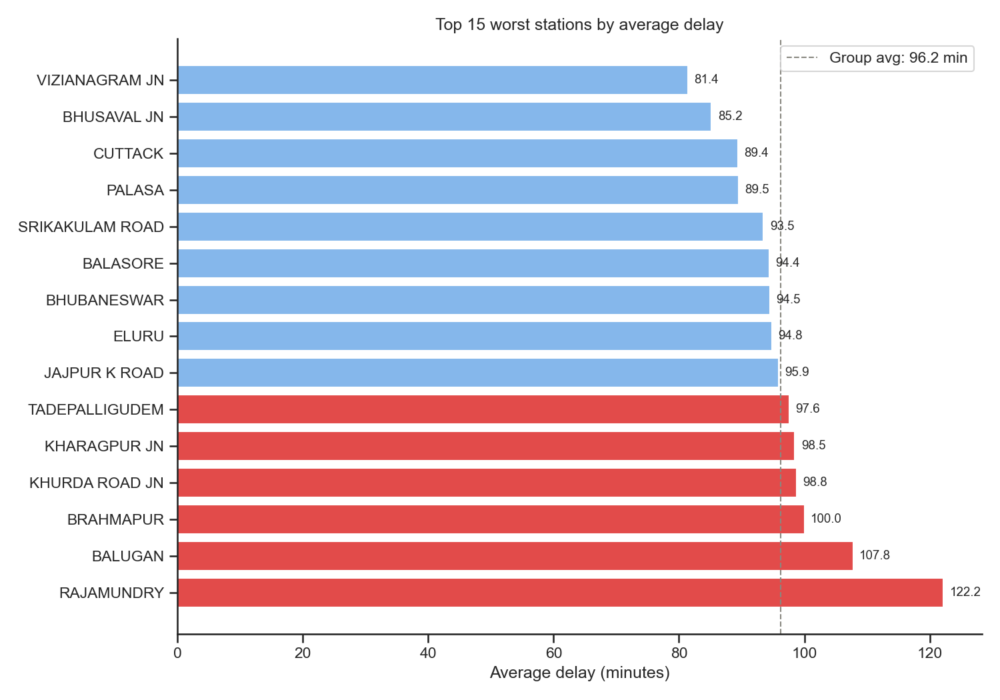
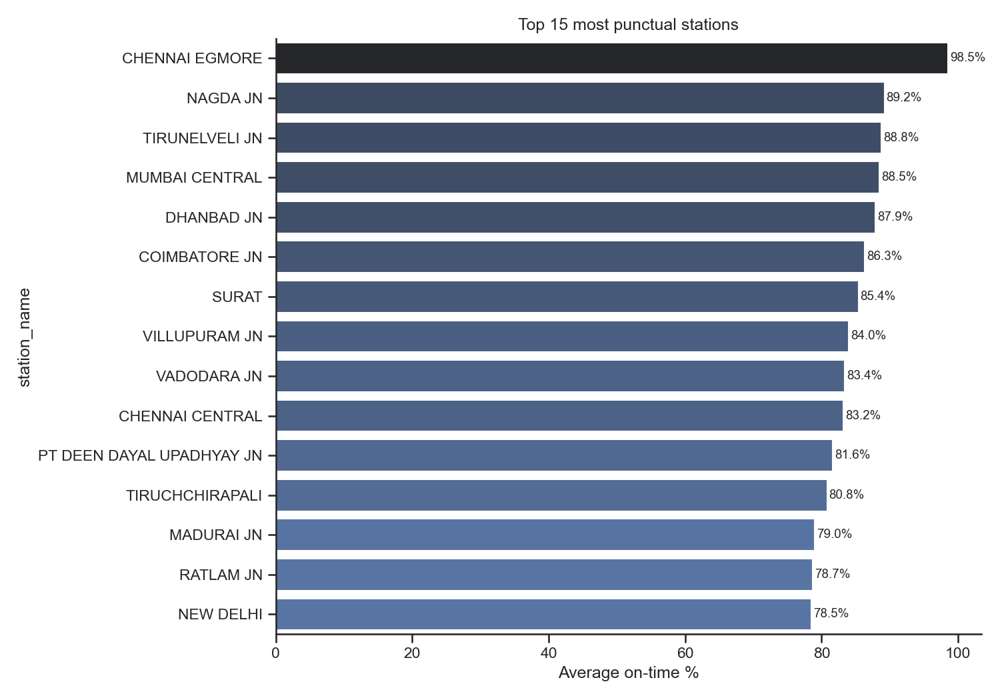
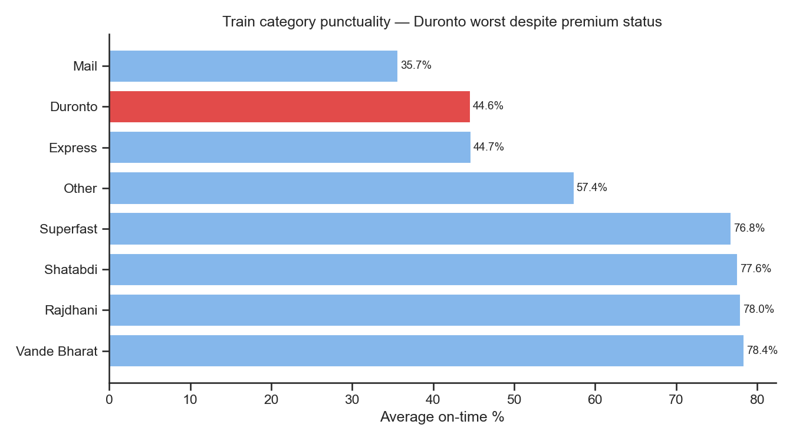
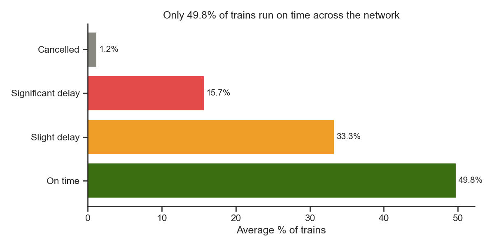

# Indian Railways Punctuality Analysis

Analysed station-level punctuality data across 90 trains and 500+ 
stations to identify which stations and train categories have the 
worst on-time performance.

## Questions Investigated
1. Which stations have the highest average delay?
2. Which stations are the most punctual?
3. Which train categories perform best and worst?
4. What % of trains run on time vs delayed vs cancelled?

## Tools Used
Python · pandas · matplotlib · seaborn · VS Code · Git

## Key Findings
- Rajamundry is the worst station — 122.2 min average delay, on time only 2.8% of trips
- Chennai Egmore is the best — 98.5% on time with just 1.8 min average delay
- Duronto trains average 118 min delay despite being a premium category — worst of all types
- Only 49.8% of trains run on time across the network

## Charts

